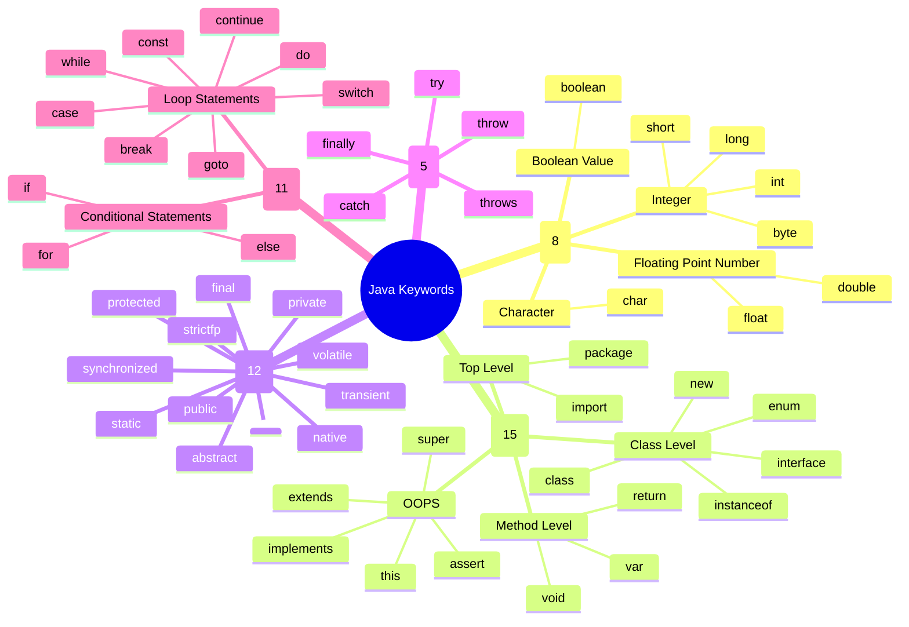

# JAVA FUNDAMENTALS - 1

## Identifiers  
1. identifiers are the names of a package, class, method, variable, interface, enum and arguements and so on.
2. identifiers can contain `A - Z`, `a - z` and `0 - 9` numbers.
3. identifiers should not contain special characters except `$` and `_`.
4. identifiers can not use any java keywords.
5. identifiers cannot start with any numbers.

examples for invalid identifiers:
```
student-name
1number
phone##
```

examples for invalid identifiers:
```
student_name
@email
phonenumber1_@
```

### Identifier rules:  
there is ethics of using different identifiers. even though if a identifier satisfy the rules there are still some ethics on how we write identifiers.
```java
package com.langfunda;

public class Identifiers {
    int studentId;
    String studentName;
    int studentAge;
    int fee;
    long phone;

    public static void main(String[] args) {
        Identifiers i1 = new Identifiers();
        System.out.println(i1.studentName);
        System.out.println(i1.studentAge);
    }
}
```  
in the above example program there are 15 identifiers they are  
`com`, `langfunda`, `Identifiers`, `String`, `System`, `studentId`, `studentName`, `studentAge`, `fee`, `phone`, `main`, `args`, `i1`, `out`, `println`
#### Package names:  
- packages are the primary folder structure that we use in java, package names generally consists of small letters and no capital letters 
    **example:**
    ```java
    com.langfundaments
    in.farhan
    net.nizam
    ``` 
- package names are generally consists the reverse of the domain name that the organization is using.
- package name can also consist numbers.

#### addtional points:
- we need follow `cammelCase` when naming variables.  
    **example:**
    ```java
    int studentId;
    String studentName;
    ```
- we need to start class, enum and interface names with a capital letters
    ```java
    class User {}
    interface Banking {}
    enum Numbers {}
    ```
| type |subtype| keywords |
|:--|:--|:--|
|**datatypes** `8`|integer|`byte`|
|||`short`|
|||`int`|
|||`long`|
||floating point number|`float`|
|||`double`|
||character|`char`|
||boolean value|`boolean`|
|**application level** `15`|top level|`package`|
|||`import`|
||class level|`class`|
|||`interface`|
|||`enum`|
|||`new`|
|||`instanceof`|
||method level|`void`|
|||`return`|
|||`var`|
||OOPS|`this`|
|||`super`|
|||`extends`|
|||`implements`|
|||`assert`|
|**modifiers and access modifiers** `12`||`private`|
|||`<default>`|
|||`protected`|
|||`public`|
|||`abstract`|
|||`static`|
|||`synchronized`|
|||`strictfp`|
|||`final`|
|||`transient`|
|||`volatile`|
|||`native`|
|**exception handling** `5`||`try`|
|||`catch`|
|||`finally`|
|||`throw`|
|||`throws`|
|**logical statements** `11`|condition statments|`if`|
|||`else`|
|||`for`|
||loop statments|`while`|
|||`do`|
|||`switch`|
|||`case`|
|||`break`|
|||`continue`|
|||`goto`|
|||`const`|  
